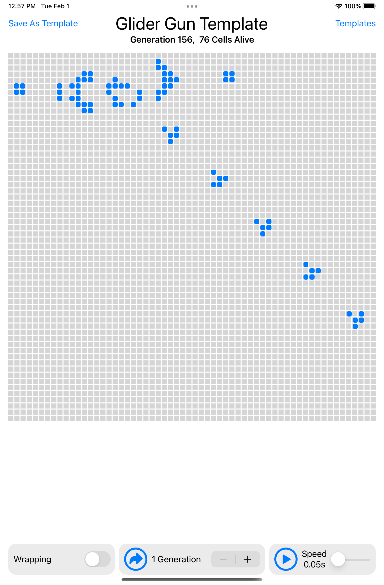
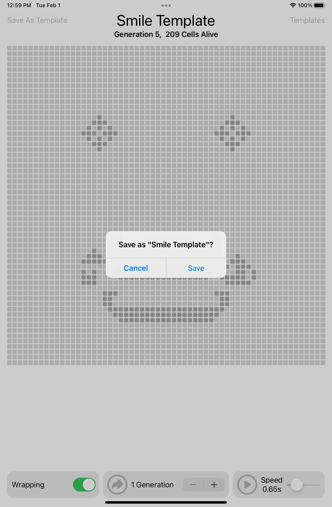
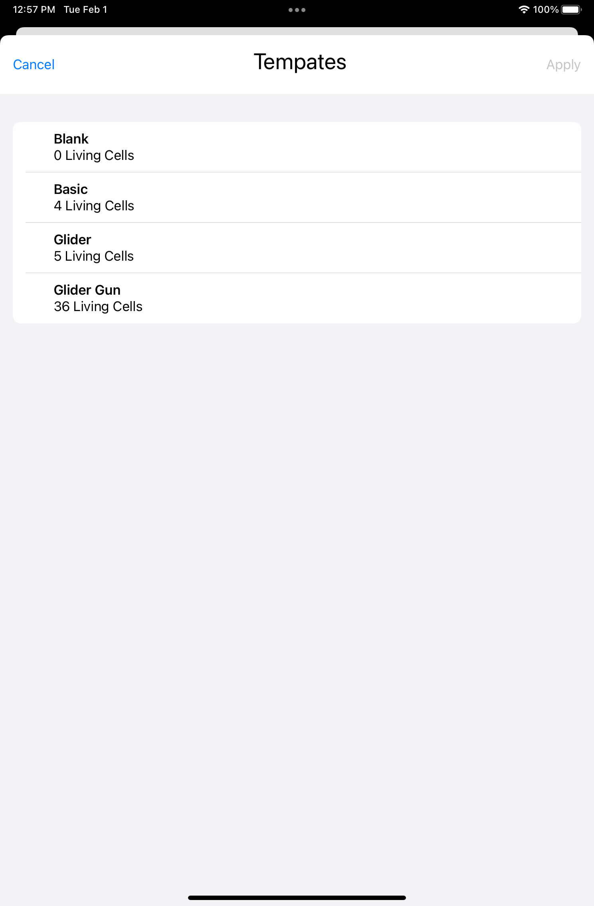

# Game of Life

An iPad app to simulate Conway's Game of Life written in SwiftUI.

## Features

The user can toggle cells between "alive" or "dead" by tapping or dragging on the board. The game can then be simulated in two ways.

1. The stepper in the middle of the control bar advances the game a specific number of generations. The number of generations for each step is be controlled with the "+" and "-" buttons.
2. The play button on the right of the control bar automatically advances the game one generation at every time step. The slider adjusts the duration of one time step

The simulation can also be configured to wrap around the edges. For example, when wrapping is enabled, cells on the left side of the board will interact with the cells on the right side of the board.

Additionally, the current board can be loaded from or saved to a template. Templates are saved to disk for persistant storage.

## Design
This app uses the standard SwiftUI convention of composing larger views from smaller views. The main view for the app is the `ColonyDetail` view. The game logic is implemented in the `Colony` struct which also serves as the model for this app.

## Purpose
This project was designed to continue to explore the functionality of SwiftUI. More importantly, it was also created to evaluate the performance of the framework for moderately intensive graphics, as to assess it applicability to other applications.

## Screenshots
The Main App Interface

Saving the Current Game as a Template

Applying a Previously Saved Template

